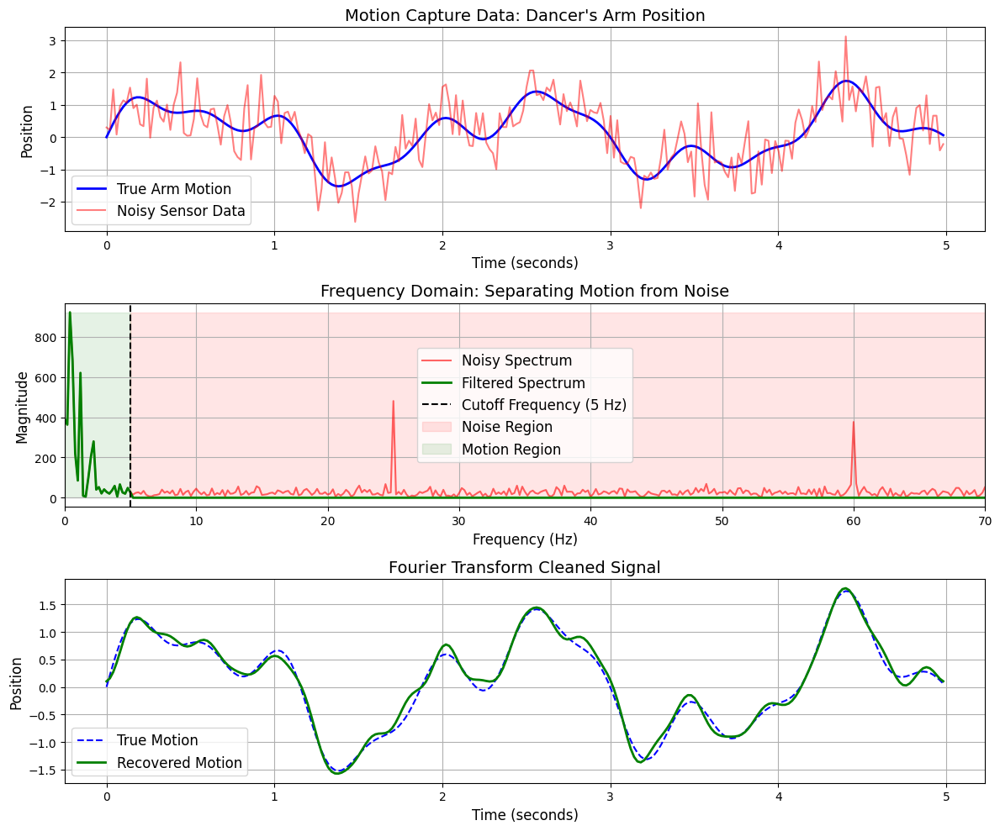

# AnimAI Project

## What This Project Is About

  

Animation is not a small or shallow topic, it’s a rich field involving geometry, motion, perception, computer graphics, and learning. While we won’t be able to cover everything, our goal is to focus on the **most intuitive and impactful ideas**, especially where **mathematics and machine learning** come together in interesting ways.

This project is not just about doing standard tasks. We’ll be:

* **Turning ideas into code**
* **Testing and iterating on them**
* **Improving results through learning-based approaches**

You’ll not just code, you’ll **build** and **think creatively** about solutions. Each exercise is built around an idea, and the aim is to understand the **process of coming up with an idea and bringing it to life**.

> 💡 *An idea becomes valuable only when you build something out of it.*

## Project Structure

All project-related exercises and resources will be available in this repository:

🔗 [**AnimAI GitHub Repository**](https://github.com/Yaswanth2747/SoC-AnimAI)

* Navigate to each `Week-XX` folder to find specific instructions, notebooks, and starter code.

Feel free to reach out to either of us directly or ask questions in the group if you're stuck or need guidance.

We’re here to learn and build together. Let’s make something awesome!

**– Yaswanth & Harshit**
